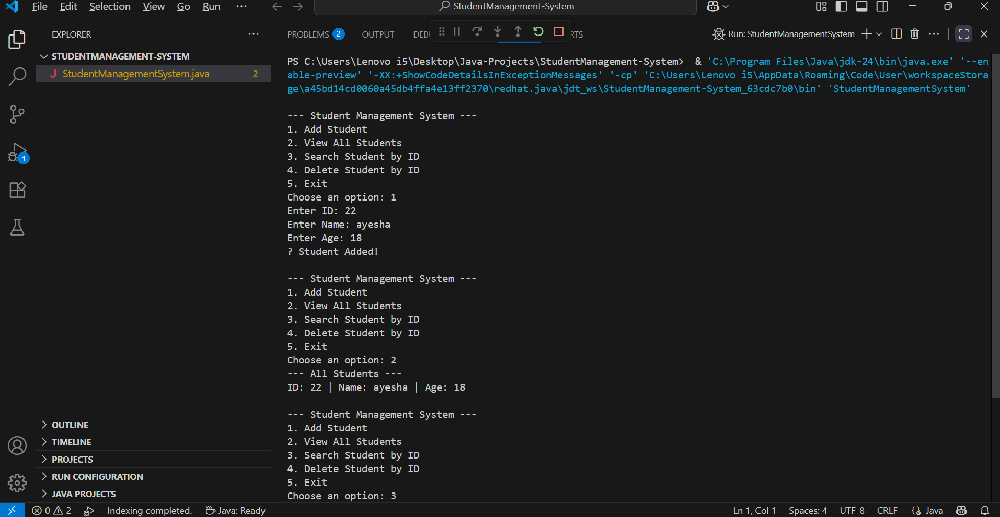
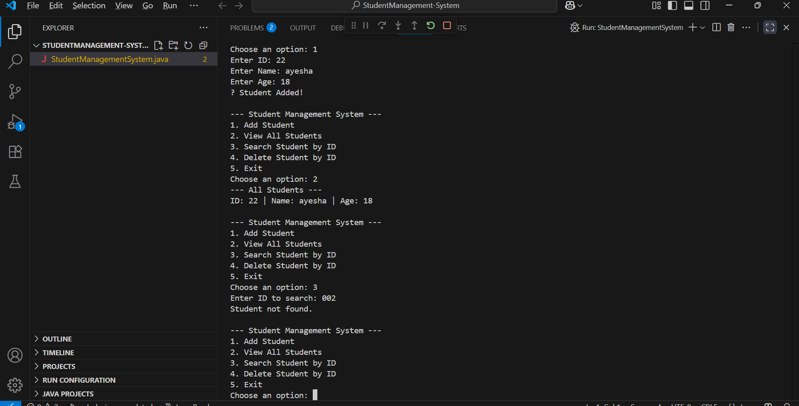

# 🎓 Student Management System (Java)

A simple Student Management System console application built in Java. This project demonstrates Object-Oriented Programming (OOP) concepts such as Classes, Objects, and ArrayLists. The system allows you to add new students with ID, Name, and Age, view all students, search for a student by ID, delete a student by ID, and provides a simple and user-friendly console interface.  

Here are some screenshots of the project in action:  
  
*Add and view students in the system.*  
  
*Search and delete students by ID.*  

To use the project, clone the repository, compile the Java file with `javac StudentManagementSystem.java`, then run it using `java StudentManagementSystem`. Follow the on-screen menu to manage students.  

This project is licensed under the MIT License. See the LICENSE file for details.
